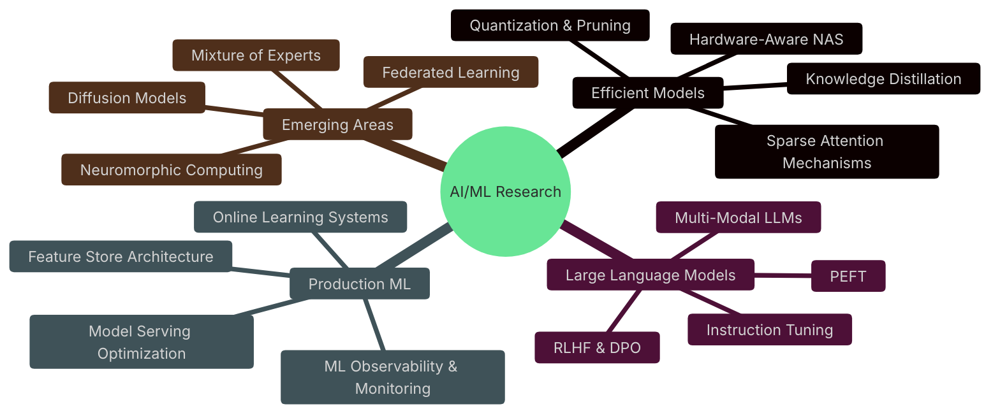
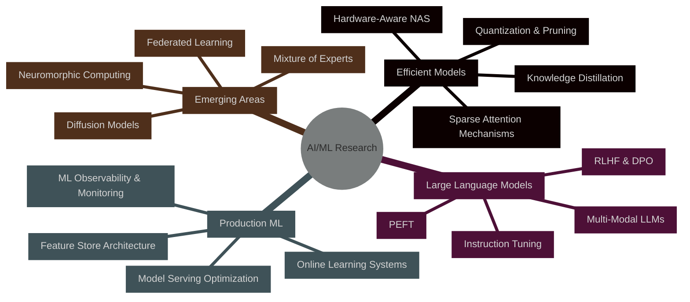

<div align="center">

```ascii
   _____ __    _                          ____                            __
  / ___// /_  (_)   ______ _____ ___     / __ \_________ ___________  ____/ /
  \__ \/ __ \/ / | / / __ `/ __ `__ \   / /_/ / ___/ __ `/ ___/ __ \/ __  /
 ___/ / / / / /| |/ / /_/ / / / / / /  / ____/ /  / /_/ (__  ) /_/ / /_/ /
/____/_/ /_/_/ |___/\__,_/_/ /_/ /_/  /_/   /_/   \__,_/____/\__,_/\__,_/
```
### `architect of intelligent systems` • `deep learning researcher` • `mlops innovator`

[](https://git.io/typing-svg)

</div>

---


##  About My Work
I am an AI/ML Engineer focused on architecting intelligent systems that bridge advanced research with real-world applications. My expertise covers the entire machine learning lifecycle—designing neural architectures, building training pipelines, and deploying models that power large-scale, high-impact solutions.

I specialize in translating cutting-edge research into production-ready systems, with experience in optimizing transformer models for efficiency, developing robust intent and NER models for assistants, and scaling distributed training for foundation models.

My approach blends strong mathematical fundamentals with pragmatic engineering practices, ensuring that every system I build is both high-performing and maintainable. I thrive on creating AI solutions that are not just innovative, but also practical, reliable, and impactful.
<br clear="right"/>


##  Technical Mastery

<details open>  
<summary><b> Core ML & Deep Learning</b></summary>  
<br>  


</details>  

<details>  
<summary><b> Advanced AI Frameworks</b></summary>  
<br>  


</details>  

<details>  
<summary><b> Cloud & Backend</b></summary>  
<br>  


</details>  

## Signature Projects  

<table>  
<tr>  
<td width="50%" valign="top">  
📄  PaperMind AI   

<a href="https://github.com/shivamprasad1001/papermind-ai">


</a>  
<br/>  
  
  

A modern PDF chatbot powered by **RAG + LangChain** that lets users upload PDFs and query them with natural language. Built with **FastAPI backend** and interactive frontend.  

`#ai` `#rag` `#pdf-chatbot`  

</td>  
<td width="50%" valign="top">  
🎵  MoodifyAI   

<a href="https://github.com/shivamprasad1001/MoodifyAI">


</a>  
<br/>  
  
  

An AI-powered **music recommendation system** that detects emotions from **facial expressions** and suggests songs tailored to the user’s mood.  

`#ai` `#music-recommendation` `#facial-expression-recognition`  

</td>  
</tr>  

<tr>  
<td width="50%" valign="top">  
🖥️  AI Desktop Assistant   

<a href="https://github.com/shivamprasad1001/AIDesktopAssistant">


</a>  
<br/>  
  
  

A fully functional **AI assistant** with speech-to-text, text-to-speech, intent detection, NER, and app-launching capabilities. Built with **custom-trained models** for natural command understanding.  

`#desktop-assistant` `#intent-classification` `#ner` `#nlp`  

</td>  
<td width="50%" valign="top">  
🧠  YOLO Object Detection     

<a href="https://github.com/shivamprasad1001/yolo-custom-trainer">


</a>  
<br/>  
  
  

Object detection pipeline using **YOLOv8** with a custom dataset. Includes **dataset annotation, training scripts, and Telegram bot integration** for real-time detection.  

`#object-detection` `#yolov8` `#computer-vision`  

</td>  
</tr>  

<tr>  
<td width="50%" valign="top">  
🔑  Password Manager System   

<a href="https://github.com/shivamprasad1001/password_manager_system">


</a>  
<br/>  
  
  

A secure **password manager web app** with Flask, MySQL, and JS. Features include **authentication, encryption, and password generation**.  

`#password-manager` `#flask` `#mysql` `#security`  

</td>  
<td width="50%" valign="top">  
🛡️  SSH-NC Handbook   

<a href="https://github.com/shivamprasad1001/ssh-nc-handbook">


</a>  
<br/>  
  
  

A **practical handbook** documenting **SSH & Netcat** for secure communication and file transfer. Includes usage notes, scripts, and examples for developers & security enthusiasts.  

`#ssh` `#netcat` `#security` `#handbook`  

</td>  
</tr>  
</table>  


##  Performance Metrics

<div align="center">
<table>
<tr>
<td width="50%">


</td>
<td width="50%">


</td>
</tr>
<tr>
<td colspan="2">

</td>
</tr>
</table>


</div>


##  Research & Innovation

My research focuses on efficient AI model architectures, aiming to push the limits of performance while drastically reducing computational costs. I investigate novel compression methods, sparse attention mechanisms, and dynamic neural networks, alongside hardware-aware architecture design.

By bridging cutting-edge research with industrial deployment, my work ensures that theoretical innovations translate into scalable, production-ready AI systems that deliver real-world impact.


##  Current Research Focus



##  2025 Goals & Roadmap



##  Professional Network

<div align="center">

[](https://linkedin.com/in/shivamprasad1001)
[](https://shivamprasad1001.vercel.app/)
[](https://huggingface.co/shivamprasad1001)
[](https://x.com/shivampr101)

</div>

---

<div align="center">

```javascript
const shivam = {
    philosophy: "Code is poetry, algorithms are art",
    currentlyLearning: ["Mixture of Experts", "Diffusion Models", "Neuromorphic Computing"],
    collaboration: "Open to research partnerships and innovative ML projects",
    funFact: "I optimize neural networks faster than I optimize my coffee intake ☕"
};
```


**"Building intelligence, one tensor at a time"** ⚡

</div>
