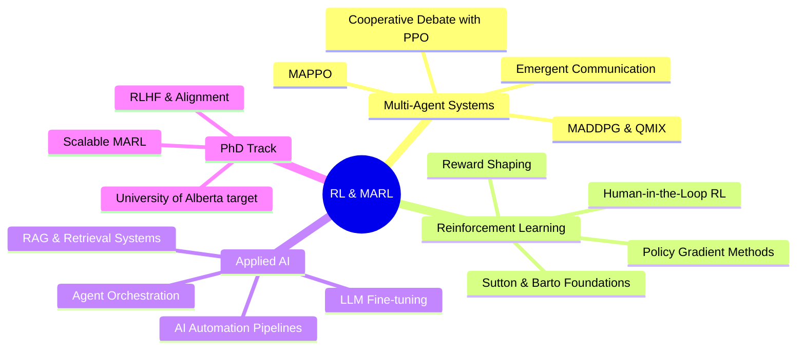
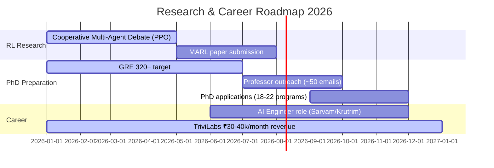

<div align="center">

```
███████╗██╗  ██╗██╗██╗   ██╗ █████╗ ███╗   ███╗    ██████╗ ██████╗  █████╗ ███████╗ █████╗ ██████╗
██╔════╝██║  ██║██║██║   ██║██╔══██╗████╗ ████║    ██╔══██╗██╔══██╗██╔══██╗██╔════╝██╔══██╗██╔══██╗
███████╗███████║██║██║   ██║███████║██╔████╔██║    ██████╔╝██████╔╝███████║███████╗███████║██║  ██║
╚════██║██╔══██║██║╚██╗ ██╔╝██╔══██║██║╚██╔╝██║    ██╔═══╝ ██╔══██╗██╔══██║╚════██║██╔══██║██║  ██║
███████║██║  ██║██║ ╚████╔╝ ██║  ██║██║ ╚═╝ ██║    ██║     ██║  ██║██║  ██║███████║██║  ██║██████╔╝
╚══════╝╚═╝  ╚═╝╚═╝  ╚═══╝  ╚═╝  ╚═╝╚═╝     ╚═╝    ╚═╝     ╚═╝  ╚═╝╚═╝  ╚═╝╚══════╝╚═╝  ╚═╝╚═════╝
```

### `Reinforcement Learning` • `Multi-Agent Systems` • `AI/ML Engineer`

[](https://git.io/typing-svg)

</div>

---


## About Me

I'm an **AI/ML Engineer** and final-year CS (AI & ML) student building intelligent systems at the intersection of **Reinforcement Learning**, **Multi-Agent coordination**, and applied AI engineering.

My current research focuses on **cooperative multi-agent debate systems** using PPO, human-in-the-loop orchestration, and scalable MARL architectures. I presented my work on adaptive multi-agent orchestration for automated code generation at **NGAISL2026 (HRIT University)**.

Alongside research, I build production AI systems and automation tools through **TriviLabs** — a web & AI agency serving Delhi NCR businesses.

**Goal:** Direct B.Tech → PhD in Reinforcement Learning & Multi-Agent Systems.

<br clear="right"/>

---

## 📄 Research & Publications

| Paper | Venue | Year |
|-------|-------|------|
| **Adaptive Multi-Agent Orchestration with Human-in-the-Loop for Automated Code Generation** | NGAISL2026, HRIT University | 2026 |

> *Current work:* Cooperative Multi-Agent Debate System with PPO — agents with opposing reward signals debate to convergence on complex reasoning tasks.

---

## 🔬 Research Focus


```mermaid
mindmap
  root((RL & MARL))
    Multi-Agent Systems
      Cooperative Debate with PPO
      MADDPG & QMIX
      MAPPO
      Emergent Communication
    Reinforcement Learning
      Policy Gradient Methods
      Sutton & Barto Foundations
      Human-in-the-Loop RL
      Reward Shaping
    Applied AI
      RAG & Retrieval Systems
      Agent Orchestration
      LLM Fine-tuning
      AI Automation Pipelines
    PhD Track
      University of Alberta target
      RLHF & Alignment
      Scalable MARL
```

---

## 🚀 Signature Projects

<table>
<tr>
<td width="50%" valign="top">

### 🤖 Cooperative Multi-Agent Debate System
*(In Progress)*


Multi-agent system where agents with **opposing reward signals debate** to convergence on complex tasks. Built on PPO with custom reward shaping for cooperative-competitive dynamics.

`#reinforcement-learning` `#marl` `#ppo` `#debate`

</td>
<td width="50%" valign="top">

### 📄 PaperMind AI
[](https://github.com/shivamprasad1001/papermind-ai)


Modern **RAG-powered PDF chatbot** — upload documents, ask questions in natural language. Full-stack with FastAPI backend and React + Vite frontend.

`#rag` `#langchain` `#pdf-chatbot` `#ai`

</td>
</tr>

<tr>
<td width="50%" valign="top">

### 🖥️ AI Desktop Assistant
[](https://github.com/shivamprasad1001/AIDesktopAssistant)


Fully functional AI assistant with **STT/TTS, intent detection, NER**, and app control — all using **custom-trained models** (no GPT wrapper).

`#nlp` `#intent-classification` `#ner` `#desktop`

</td>
<td width="50%" valign="top">

### 🎵 MoodifyAI
[](https://github.com/shivamprasad1001/MoodifyAI)


Detects **emotions from facial expressions** in real-time and recommends music tailored to the user's current mood.

`#computer-vision` `#emotion-detection` `#music-recommendation`

</td>
</tr>

<tr>
<td width="50%" valign="top">

### 🔍 YOLO Custom Trainer
[](https://github.com/shivamprasad1001/yolo-custom-trainer)


End-to-end object detection pipeline — annotation with Label Studio, training, evaluation, and **real-time Telegram bot deployment**.

`#yolov8` `#computer-vision` `#object-detection`

</td>
<td width="50%" valign="top">

### 🛠️ TriviLabs
[](https://trivilabs.in)


Web & AI automation agency — full-stack apps, AI workflows, and automation pipelines for Delhi NCR businesses.

`#agency` `#ai-automation` `#web-development`

</td>
</tr>
</table>

---

## 🛠️ Technical Stack

<details open>
<summary><b>🧠 ML & Reinforcement Learning</b></summary>
<br>


</details>

<details>
<summary><b>🔧 AI Engineering & Agents</b></summary>
<br>


</details>

<details>
<summary><b>🌐 Full Stack & Cloud</b></summary>
<br>


</details>

---

## 📊 Stats

<div align="center">
<table>
<tr>
<td width="50%">

</td>
<td width="50%">

</td>
</tr>
<tr>
<td colspan="2">

</td>
</tr>
</table>


</div>

---

## 🗺️ 2026 Roadmap


```mermaid
gantt
    title Research & Career Roadmap 2026
    dateFormat YYYY-MM
    section RL Research
    Cooperative Multi-Agent Debate (PPO)   :active, 2026-01, 4M
    MARL paper submission                  :2026-05, 3M
    section PhD Preparation
    GRE 320+ target                        :active, 2026-01, 6M
    Professor outreach (~50 emails)        :2026-07, 3M
    PhD applications (18-22 programs)      :2026-09, 3M
    section Career
    AI Engineer role (Sarvam/Krutrim)      :2026-06, 6M
    TriviLabs ₹30-40k/month revenue       :active, 2026-01, 12M
```

---

## 🤝 Connect

<div align="center">

[](https://linkedin.com/in/shivamprasad1001)
[](https://shivamprasad1001.vercel.app/)
[](https://trivilabs.in)
[](https://huggingface.co/shivamprasad1001)
[](https://x.com/shivampr101)
[](https://gwen-xi.vercel.app)

</div>

---

<div align="center">

*"Agents that debate are smarter than agents that agree."*


</div>
